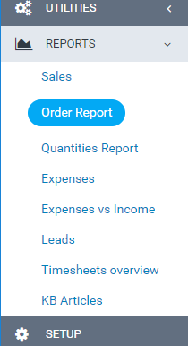
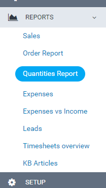

# 📊 Analytics & Reports

Track sales, conversion, and inventory.

---

## ⚙️ Enabling Analytics

1. Go to **Setup → Settings → Products**.
2. Under **Features**, enable **Analytics**.
3. Save.

---

## 📈 Analytics Dashboard

Navigate to **Products → Analytics** (or Reports → Analytics).

### 📌 Metrics

- **Total orders** — Count of completed orders.
- **Abandoned carts** — Carts left without purchase.
- **Conversion rate** — Orders / (Orders + Abandoned carts).
- **Revenue** — Total revenue from product orders.

### Abandoned Carts List

- Shows recent abandoned carts with customer and cart total.
- Used with abandoned cart email reminders.

---

## 📋 Order Report

1. Go to **Reports → Order Report** (or Products → Order Report).

2. View order data with date filters.
3. Create custom charts for specific date ranges.

---

## 📦 Quantities Report

1. Go to **Reports → Quantities Report**.

2. Monitor product quantities.
3. Products at or below the **low quantity** threshold (from Settings) are highlighted.

---

## ✅ Data Accuracy

- Reports use paid invoices and order data.
- Abandoned cart tracking requires the feature to be enabled.
- Ensure cron jobs are configured for abandoned cart emails and other scheduled tasks.
