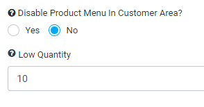
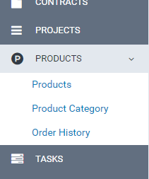
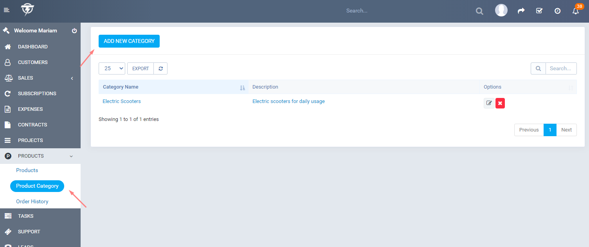
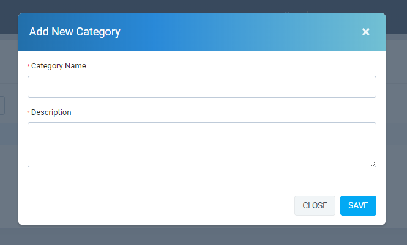
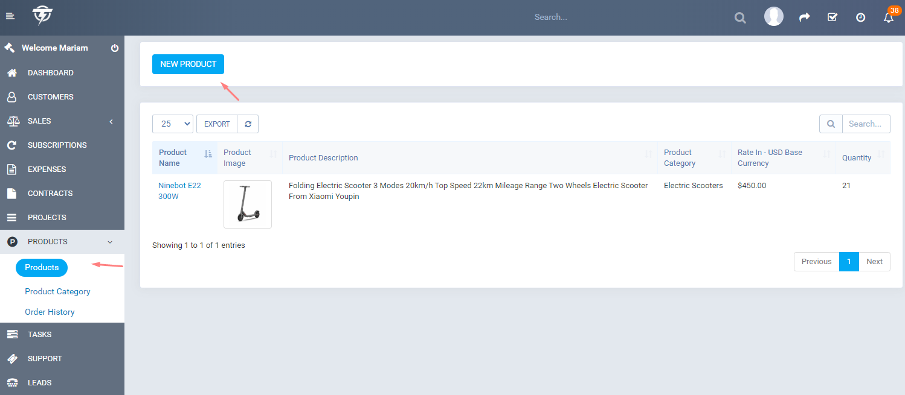
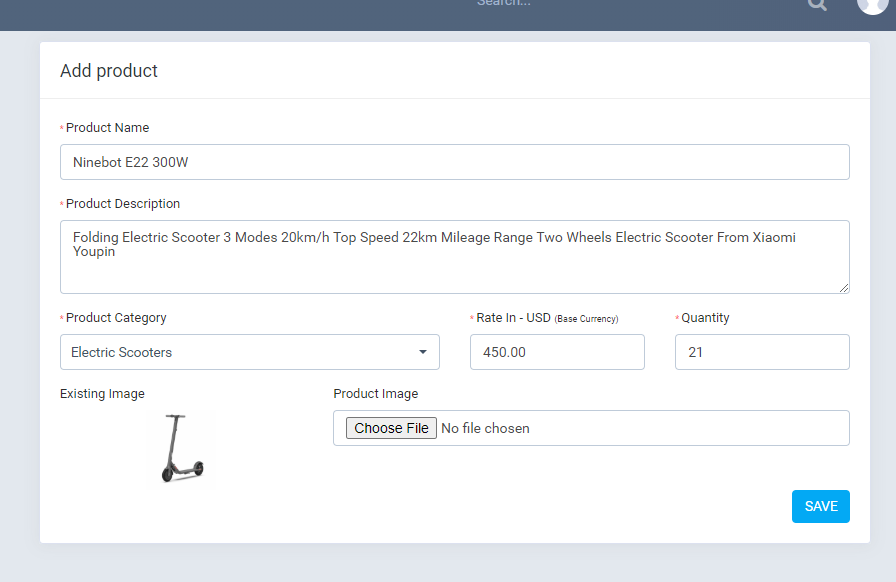
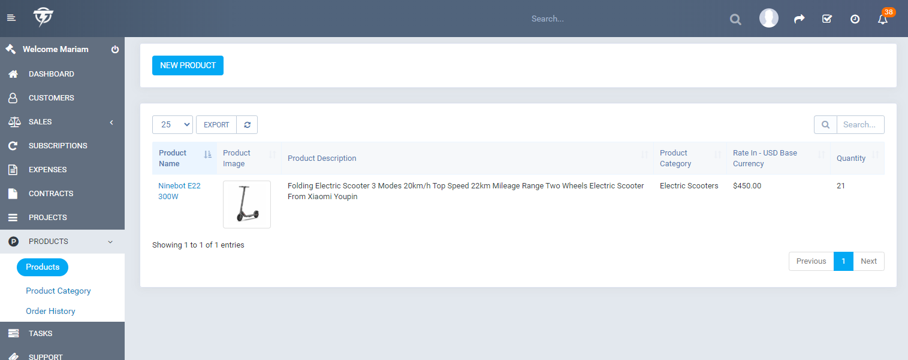

# Getting Started

This guide helps you set up Perfex Shop and make your first sale.

## Initial Setup Flow

```
1. Configure Settings → 2. Create Categories → 3. Add Products → 4. (Optional) Set up Coupons → 5. Go Live
```

## 1. Configure Module Settings

Before adding products, review the core settings:

1. Go to **Setup → Settings → Products** tab.


2. Configure:
   - **Products menu** — Enable or disable the Products menu in the customer area.
   - **Low quantity** — Threshold for low-stock warnings (used in reports).
   - **Shipping** — Flat rate shipping and tax settings.
   - **Coupons** — Enable or disable coupon functionality.

## 2. Create Product Categories

Categories organize your products and help customers browse.



### How to Create a Category

1. Navigate to **Products → Products Categories**.
2. Click **Add New Category** (or use the modal if available).
3. Fill in:
   - **Category name** — e.g., "Electronics", "Books"
   - **Description** — Optional
   - **Parent category** — For hierarchical categories
4. Click **Save**.





You can create multiple categories before adding products.

## 3. Add Your First Product

1. Go to **Products → Products**.
2. Click **New Product**.


3. Complete the form:
   - **Category** — Select the product category
   - **Product name** — e.g., "Wireless Headphones"
   - **Description** — Product details
   - **Rate** — Price (in your base currency)
   - **Tax** — Select applicable taxes
   - **Quantity** — Stock quantity
   - **Image** — Upload a product image
4. Click **Save**.





### Product Types

- **Physical** — Standard products with inventory
- **Digital** — Downloadable files (enable in Settings)
- **Service** — No inventory tracking

## 4. Test the Customer Experience

1. Log in as a customer (or create a test customer).
2. Navigate to the **Products** link in the customer area.
3. Browse products, add to cart, and complete a test order.

## 5. Enable Optional Features

As needed, enable in **Settings → Products**:

- **Wishlist** — Let customers save products for later
- **Product detail pages** — Individual product URLs
- **Reviews** — Customer reviews and ratings
- **Coupons** — Discount codes
- **Remarketing** — Facebook/Google pixels

---

**Next:** [Products & Categories](products-and-categories.md) — Full product and category management.
