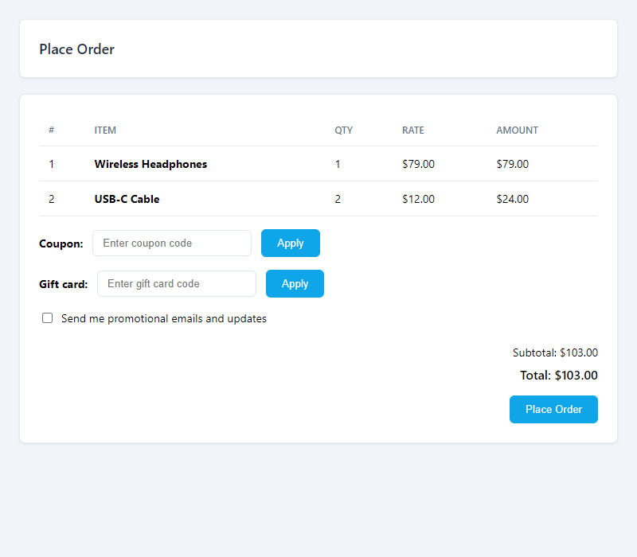
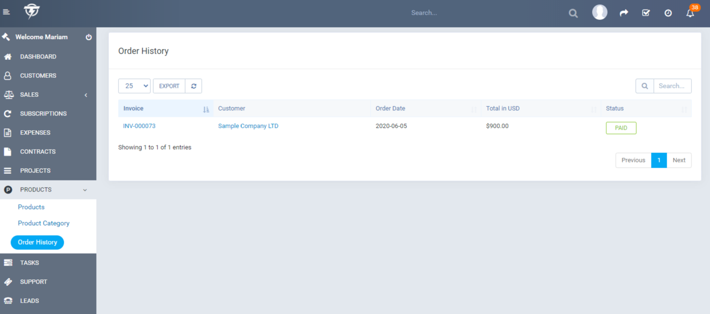

# 🛒 Orders & Checkout

This section describes the order lifecycle and checkout process.

---

## 📦 Order Flow (Overview)

```
Customer browses products → Adds to cart → Goes to checkout → Places order → Invoice created → Payment → Order complete
```

---

## 🛍️ Client Checkout Flow

1. **Browse products** — Customer views products (with optional category filter).
2. **Add to cart** — Clicks "Add to Cart" (with variation selection if applicable).
3. **View cart / Place order** — Clicks "View Cart and Checkout".
4. **Checkout page** — Sees cart items and can:
   - Adjust quantities
   - Remove items
   - Apply coupon (if enabled)
   - Apply gift card (if enabled)
   - Opt in to newsletter (if enabled)



5. **Place order** — Submits the form.
6. **Invoice created** — Perfex creates an invoice for the order.
7. **Payment** — Customer is redirected to the invoice to pay.
8. **Order complete** — After payment, quantity is updated and emails are sent.

---

## 👤 Staff Orders

Staff can create orders on behalf of customers without using the storefront:

1. Go to **Products → Add New Order** (or **Staff Order**).
2. Select the **client**.
3. Add products (with quantities).
4. Apply coupon if needed.
5. Create the order. An invoice is generated.

---

## 📜 Order History

1. Go to **Products → Order History**.


2. View all orders with:
   - Order ID
   - Client
   - Invoice link
   - Status
   - Date

---

## 📄 Order Status & Invoices

- Orders are tied to Perfex **invoices**.
- When an invoice is marked **Paid**, the module:
  - Reduces product quantity
  - Sends order confirmation emails
  - Triggers gift card creation (for gift card purchases)
  - Records referral commissions (if applicable)

---

## 🛒 Cart Behavior

- Cart data is stored in the **session**.
- Logged-in customers: cart can be associated with the client.
- **Abandoned cart** tracking (if enabled) records carts that are not completed.

---

## 🎟️ Coupon & Gift Card at Checkout

- **Coupon** — Enter code and click Apply. Discount is shown.
- **Gift card** — Enter gift card code and click Apply. Balance is applied to the total.

Both can be used together in a single order where rules allow.
