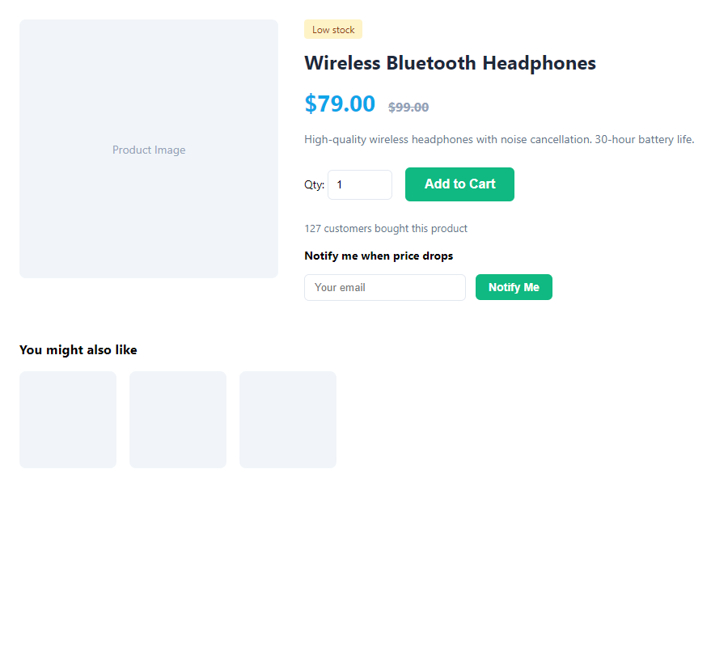

# 🔍 Product Detail Pages & SEO

Individual product pages improve user experience and SEO.

---

## ⚙️ Enabling Product Detail Pages

1. Go to **Setup → Settings → Products**.
2. Under **Features**, enable **Product detail pages**.
3. Save.

---

## 🖥️ How It Works

- Each product can have a **slug** (URL-friendly identifier).
- Products are accessible at: `yoursite.com/products/client/product/product-slug`

- If slug is empty, the product ID may be used or the product may only appear in the listing.

---

## 📈 SEO Features

When **SEO meta** is enabled in Settings:

- **Meta title** — From product meta title or product name.
- **Meta description** — From product meta description or trimmed product description.
- **Canonical URL** — Prevents duplicate content issues.

---

## 📄 Product Page Content

The product detail page typically shows:

- Product image
- Product name
- Price (with variation selection if applicable)
- Description
- Add to cart
- Reviews (if enabled)
- Back-in-stock form (if out of stock and feature enabled)
- Price drop alert form (if enabled)
- Related products / recommendations (if enabled)

---

## 🔗 Slug Configuration

When adding or editing a product:

- Set a **slug** (e.g., `wireless-headphones`) for a clean URL.
- Slugs should be unique and URL-safe (lowercase, hyphens, no spaces).
