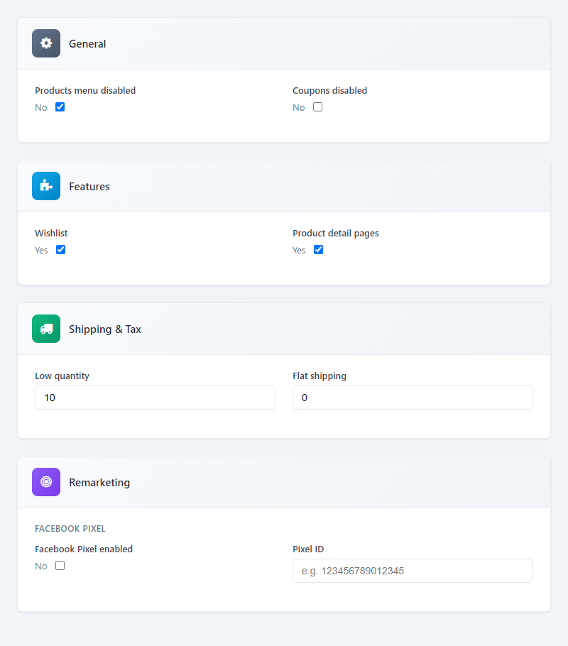

# ⚙️ Settings

All module settings are under **Setup → Settings → Products**. This page summarizes every option.

---

## 📋 General

| Option | Description |
|--------|-------------|
| **Products menu disabled** | Hide the Products menu from the customer area |
| **Products menu (non-logged-in)** | Hide Products for guests |
| **Hidden prices (non-logged-in)** | Hide prices from guests |
| **B2B mode** | Hide prices (B2B catalog) |
| **Coupons disabled** | Disable coupon functionality |

---

## ✨ Features

| Option | Description |
|--------|-------------|
| **Wishlist** | Enable wishlist for customers |
| **Product detail pages** | Individual product URLs |
| **SEO meta** | Meta title, description, canonical |
| **Analytics** | Analytics dashboard and reports |
| **Abandoned cart tracking** | Record abandoned carts |
| **Digital downloads** | Enable digital products and My Downloads |

---

## Shipping & Tax

| Option | Description |
|--------|-------------|
| **Low quantity** | Threshold for low-stock warnings |
| **Flat shipping** | Flat rate shipping cost |
| **Tax for shipping** | Tax applied to shipping |

---

## 📣 Remarketing

| Option | Description |
|--------|-------------|
| **Facebook Pixel** | Enable + Pixel ID |
| **Google Ads** | Enable + Conversion ID + Label |
| **Custom script** | Enable + paste tracking code |

---

## 🛒 Abandoned Cart Email

| Option | Description |
|--------|-------------|
| **Enable** | Send abandoned cart emails |
| **Delay (hours)** | Wait before sending |

---

## 🎯 Exit Popups

| Option | Description |
|--------|-------------|
| **Enable** | Show exit popups on storefront |
| **Dismiss days** | Days to hide after dismiss |

---

## 📱 WhatsApp / SMS Notifications

| Option | Description |
|--------|-------------|
| **Enable** | Enable notification system |
| **SMS Gateway URL** | Global SMS webhook |
| **WhatsApp Gateway URL** | Global WhatsApp webhook |

---

## 📢 Marketing Features

| Option | Description |
|--------|-------------|
| **Reviews** | Product reviews and ratings |
| **Referral** | Referral program |
| **Back in stock** | Back-in-stock alerts |
| **Price drop** | Price drop alerts |
| **Recommendations** | Related products |
| **Newsletter** | Marketing consent at checkout |
| **Urgency** | Low-stock badges |
| **Gift cards** | Gift card purchase and redemption |
| **Gift card min amount** | Minimum gift card purchase |
| **Referral commission %** | Commission percentage |
| **Referral commission fixed** | Fixed commission per order |
| **Upsell** | Post-purchase upsell |
| **Social proof** | "X customers bought" + "X just purchased" |
| **Recent purchase (hours)** | How many hours to show "X just purchased" (1–168) |
| **Show "Someone" instead of names** | Use anonymous "Someone" or show first name |
| **A/B testing** | (Placeholder) |
| **Segmentation** | (Placeholder) |

---

## 🔥 Heatmap

| Option | Description |
|--------|-------------|
| **Enable** | Inject heatmap/session recording script |
| **Script** | Paste provider's JavaScript |

---

## ⏰ Cron Jobs

At the bottom of the settings page, a **Cron Jobs** section lists all required cron URLs with descriptions and recommended frequency. See [Cron Jobs](cron-jobs.md).
